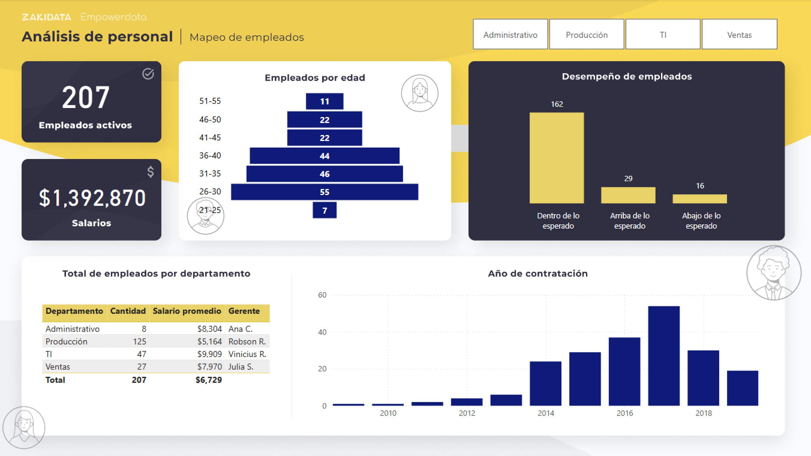

# ENGLISH

# HR Analytics Dashboard

## 📌 Project Overview
This project is a **Power BI dashboard** designed to analyze key human resources metrics. It helps HR managers understand employee distribution, performance, compensation, and tenure, supporting data-driven decisions.

The dashboard includes:
- Total number of employees
- Total salaries
- Employees and salaries by department
- Employee performance
- Employee age
- Years of service

---

## 🛠️ Tools & Technologies
- **Power BI**: Main dashboard and interactive visualizations  
- **Excel**: Source data  
- **Data Analysis**: Aggregation, KPIs calculation, trends, and performance metrics  

---

## 📷 Dashboard Preview

---

## 📂 Repository Structure
/HR_Analytics_Dashboard
/dashboard # Power BI file (.pbix)
/images # screenshots for README
/data # example datasets (if any)
README.md # project documentation

---

## 🚀 How to Explore
1. Open the Power BI file (`.pbix`) in Power BI Desktop.  
2. Interact with the visualizations to explore HR metrics.  
3. Analyze employee distribution, performance, salaries, and tenure trends.  

---

## 📌 Next Steps / Enhancements
- Integrate with live HR databases for real-time monitoring  
- Add predictive analytics to forecast staffing needs and performance  
- Expand KPIs to include employee satisfaction and turnover analysis  

---

✨ **Author:** Lexa Pérez  
📧 Contact: lexaperez24@gmail.com  
🔗 GitHub: [https://github.com/lexaperez24/HR_Analytics_Dashboard](https://github.com/lexaperez24/HR_Analytics_Dashboard)

---

# ESPAÑOL

# Dashboard de Analítica de Recursos Humanos

## 📌 Descripción del Proyecto
Este proyecto consiste en un **dashboard de Power BI** diseñado para analizar métricas clave de recursos humanos. Permite a los gerentes de RR.HH. entender la distribución de empleados, desempeño, salarios y antigüedad, apoyando la toma de decisiones basada en datos.

El dashboard incluye:
- Número total de empleados
- Total de salarios
- Empleados y salarios por departamento
- Desempeño de los empleados
- Edad de los empleados
- Años de contratación

---

## 🛠️ Herramientas y Tecnologías
- **Power BI**: Creación del dashboard y visualizaciones interactivas  
- **Excel**: Fuente de datos  
- **Análisis de datos**: Agregaciones, cálculo de KPIs, tendencias y métricas de desempeño  

---

## 📷 Vista Previa del Dashboard

---

## 📂 Estructura del Repositorio
/HR_Analytics_Dashboard
/dashboard # Archivo Power BI (.pbix)
/images # Capturas para el README
/data # Datos de ejemplo (si aplica)
README.md # Documentación del proyecto

---

## 🚀 Cómo Explorar el Dashboard
1. Abre el archivo Power BI (`.pbix`) en Power BI Desktop.  
2. Interactúa con las visualizaciones para explorar las métricas de RR.HH.  
3. Analiza la distribución de empleados, desempeño, salarios y antigüedad.  

---

## 📌 Próximos Pasos / Mejoras
- Integración con bases de datos de RR.HH. en tiempo real  
- Añadir análisis predictivo para anticipar necesidades de personal y desempeño  
- Expandir KPIs para incluir satisfacción del empleado y análisis de rotación  

---

✨ **Autor:** Lexa Pérez  
📧 Contacto: lexaperez24@gmail.com  
🔗 GitHub: [https://github.com/lexaperez24/HR_Analytics_Dashboard](https://github.com/lexaperez24/HR_Analytics_Dashboard)
